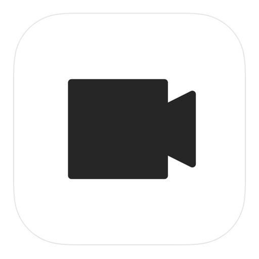
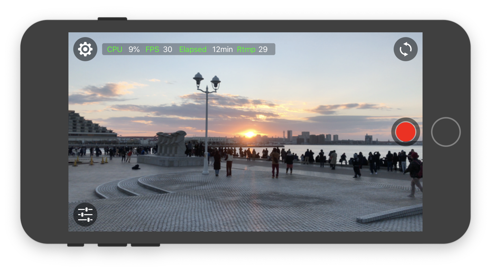
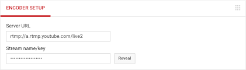

Moved to ItsMyLive  
https://github.com/koji4104/ItsMyLive  

# It's my live

 

**It's my live** is available for free at the Apple Store. Available for iPhone and iPad.

## :movie_camera: Features

**It's my Live** is a live distribution application.

* HLS (HTTP Live Streaming)  
Viewable on browser on same network.
* RTMP (Real Time Messaging Protocol)  
Delivery to RTMP server.
* SRT (Secure Reliable Transport)  
Deliverable with SRT protocol.
 
It is only distribution. There is no ability to save and receive video.

## :blue_book: How to use HLS

HLS can be played on Safari on Mac or Edge on Win. You can play the camera image by entering the address displayed on MyLive in the browser address (local network only)

## :blue_book: How to use RTMP

### YouTube

Enter URL and KEY in App. Note that the KEY changes each time the button is pressed.

### AWS MediaLive

e.g. rtmp://xxxx/test/test1  
URL = rtmp://xxxx/test  
KEY = test1  

Japanese Article (日本語記事)
https://qiita.com/koji4104/items/c1b4ddd27fa0f9c011d9

## :blue_book: How to use SRT

FFMpeg does not support SRT by default, so it needs to be built.

MyLive srt://(YourPC_IP):3000  
FFPlay -i "srt://0.0.0.0:3000?mode=listener"   

MyLive srt://:3000 or srt://localhost:3000  
FFPlay -i "srt://(iOS_IP):3000"  

## :speech_balloon: Question
Please in 日本語 or English

